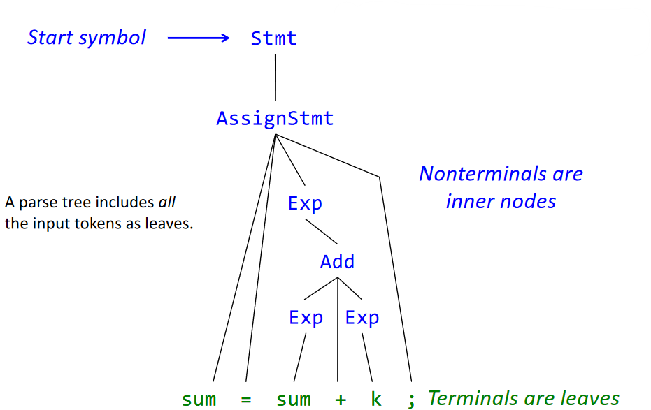

# Lecture 3 

Parsing

Link to lecture slides: [L03](https://fileadmin.cs.lth.se/cs/Education/EDAN65/2022/lectures/L03.pdf)


## RE vs Context-Free Grammars

An RE can have *iteration*

A CFG can also have *recursion* (it is possivle to derive a symbol, e.g., `Stmt`, from itself)

### Example RE
```
WHILE = "while" 
ID = [a-z][a-z0-9]*
PLUS = "+"
...
```

### Example CFG
```
Stmt --> WhileStmt
Stmt --> AssignStmt
Exp --> ID 
...
```

## Nonterminal 

```
X           -> s1 s2 ... s3             <- Production rules
nonterminal    terminals - toker
               nonterminls                  start symbol
```

### Exercise 

Construct a grammar covering this program and similar ones: 

Example program:

```
while (k <= n) {sum = sum + k; k = k+1;}
```

CFG:
```
Stmt        --> WhileStmt | Blcok | AssignStmt
WhileStmt   --> "while" "(" Exp ")" Stmt
Exp         --> LessEq | Add | ID | INT 
LessEq      --> Exp "<=" Exp
Block       --> "{" Stmt* "}"   // shortcut, instead of StmtList
Assignment  --> ID "=" EXP ";"
Add         --> Exp "+" Exp
```

## Parsing

Use the grammar to derive tree for a program (top-down): 

```
A -> B | C | D
// equal to 
A -> B 
A -> C 
A -> D 
```
Use the grammar to derive a tree program:




## EBNF vs Canonical Form

(Extended) Backus-Naur Form:
- Compact, easy to read and write
- BNF has alternatives 
- EBNF has additionally repetition, optionals, parantheses (like REs)
- Common notation for parctial use

Canonical form: 
- Core formalism for CFGs 
- Useful for proving properties and explaining algorithms

## Formal definition of CFGs (caconicla form)

A context-free frammar G = (N, T, P, S), where 
- N - the set of nonterminal symbols
- T - the set of terminal sumbols 
- P - the set of production rules, each with the form 
´´´
X -> Y1 Y2 ... Yn
where X in N, n >= 0 and Yk in N union T
´´´
- S - the symbol (one of the nonterminals), i.e. S in N

### Exercise

```
G = (N, T, P, S)

P = {
    Stmt -> ID "=" Exp ";" ,
    Stmt -> "{" Stmt "}" , 
    Stmt -> epsilon ,
    Stmt -> Stmt Stmts ,
    Exp -> Exp "+" Exp , 
    Exp -> IDs
}

N = {Stmt, Stmts, Exp}

T = {ID, "=", ";", "{", "}", "+"}

S = Stmt
```

```
L(G) = { "{" "}", ID "=" ID ";", "{" "{" "}" "}", ...}
L(G) = {w in T* | S =*> w}
```

#### Derivation 

The entire thing is derivation, each line is a derivation step.
```
Stms => "{" Stmts "}"
     =>  "{" Stmt Stmts "}"
     =>  "{" "{" Stmt "}" Stmts "}"
     =>  "{" "}"
```

### Exercise 

Prove that `INT + INT * INT` belongs to the language of the following grammar: 
```
p1: Exp -> Exp "+" Exp 
p2: Exp -> Exp "*" Exp 
p3: Exp -> INT
```

**Proof**:
Exp => Exp "+" Exp              (p1)
    => Exp "+" Exp "*" Exp      (p2)
    => Exp "+" Exp "*" INT      (p3)
    => Exp "+" INT "*" INT      (p3)
    => INT "+" INT "*" INT      (p3)

(be sure to show all the steps)

We choose the rightmost Exp to replace with INT, called **Rightmost derivation**, vice versa for **Leftmost derivation**.

Buttom up uses rightmost derivation, top down uses leftmost derivation.

---

## Parsing

LR more powerful than LL